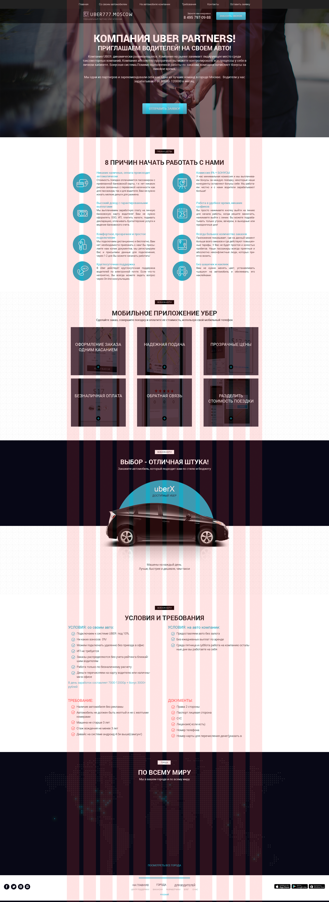

# Responsive web-design landing page
A website project based on 2 layouts ([full](#full-size) and [mobile](#mobile) version) with responsive design to all device sizes.

## Contents

- [Experience](#experience)
- [Demo](#demo)
- [How to Use](#how-to-use)
- [Features and structure](#features-and-structure)
	- [Optimization](#optimization)
	- [Code flexibility and speed-up](#code-flexibility-and-speed-up)
	- [Adaptive design](#adaptive-design)
- [Layouts](#layouts)
	- [Full-size](#full-size)
	- [Mobile](#mobile)

<h2 id="experience">Experience	🎓</h2>

In  this  project i practice: 
- Some elements of **Bootstrap 4**:
	`grid.min.css` to simplify adaptation;
	`reboot.min.css` based on `normalize.css`.
- **SASS** preprocessor (**pseudoclasses, pseudoelements, mixins and variables**);
- CSS animations
- Creating a **responsive** design based on the combination of adaptive and rubber;
- Using a local **icon font** for social media logos;
- Writing a small script (on **JavaScript**) for the mobile version;
- Using vendor prefixes.

## Demo
The completed project can be viewed [here](https://rimerian.github.io/Uber-landing/ "demo url")

<h2 id="how-to-use">How to Use 🔧</h2>

### Running a project locally
If you wish to run project locally as is, then all that's required is the `css`, `fonts`,`icons`,`img`, `js` folders and the `index.html` file from this repository. Then just need  to open `index.html`.

## Features and structure
<h3 id="optimization">Optimization 📈</h3>

- `css/bootstrap-grid.min.css`, `css/bootstrap-reboot.min.css`
	Using only the necessary minified Bootstrap libraries makes site adaptation convenient (due to the bootstrap grid column system), with minimal impact on the site loading speed.
- `css/font.css`, `fonts/` folder
	The local icon font, which contains only the elements necessary for the site, is also designed to reduce loading time and make the icon library reusable for future projects.
- `css/style.min.css`, `css/style.min.css.map`
	The resulting style file `style.min.css`, compiled by the preprocessor, is also minified for optimization purposes.
	
<h3 id="code-flexibility-and-speed-up">Code flexibility and speed-up ⚡️</h3>

- The use of the CSS preprocessor, in particular SASS, made it possible to speed up the layout and reduce the repeatability of the code.
	> :open_file_folder:	sass
	> >:page_facing_up:	`_general.sass`
	> >:page_facing_up:	`_media.sass`
	> >:page_facing_up:	`_mixins.sass`
	> >:page_facing_up:	`_variables.sass`
	> >:page_facing_up:	`style.sass`

- All the main colors of the design are set as variables, which allows you to easily and quickly change the color palette of the site if necessary.
	```SASS
	// _variables.sass (declaration)
	$blue: #1eacc7
	$black: #000000
	$dark: #222222
	$white: #ffffff
	$red: #ff5656
	```
	```sass
	// _general.sass (using)
	.menu
		...
		&_link
			color: $white
			...
			&:hover
				...
				color: $blue
				...
	```
- Using mixins for unified elements (in our case, buttons) in the project makes it easier to change their behavior in one place if necessary
	```sass
	// _mixins.sass (declaration)
	=btn_hover
		&:hover
			background-image: none
			background-color: $blue
			box-shadow: inset 2px 2px 5px rgba(0, 0, 0, 0.12), 1px 1px 5px rgba(0, 0, 0, 0.12)
	```
	```sass
	// _general.sass (using)
	.subheader
		...
		&_btn
			...
			+btn_hover
	```
<h3 id="adaptive-design">Adaptive design 📐</h3>

- Bootstrap grid system made it easier to adapt the site to different displays
	```html
	<section  class="promo">
		<div  class="container">
			<div  class="row">
				<!-- Using Bootstrap Grid System for adapting -->
				<div  class="col-md-12 offset-md-0 col-lg-10 offset-lg-1">
				...
				</div>
			</div>
		</div>
	</section>
	```
- And using **Media Queries** is necessary to indicate more specific design changes on different screen sizes.
	```sass
	// _media.sass (usage example)
	@media (max-width: 1200px)
		.menu
			&_item
				padding-right: 20px
			&_link
				font-size: 13px
		...
	```
	
	
- The mobile menu script was also written to adapt to the appropriate device type 
	```javascript
	// Mobile menu script (hamburger)
	window.addEventListener('DOMContentLoaded',  ()  =>  {
		const menu = document.querySelector('.menu'),
		menuItem = document.querySelectorAll('.menu_item'),
		hamburger = document.querySelector('.hamburger');
		
		// switching class when clicking on "hamburger"
		hamburger.addEventListener('click',  ()  =>  {
			hamburger.classList.toggle('hamburger_active');
			menu.classList.toggle('menu_active');
		});
		
		// switching class when clicking on any menu item
		menuItem.forEach(item  =>  {
			item.addEventListener('click',  ()  =>  {
				hamburger.classList.toggle('hamburger_active');
				menu.classList.toggle('menu_active');
			})
		})
	})
	```
	#### Demo
	
	
	
## Layouts
The site layouts is shown below. 
*The layouts in other formats is also available in the [repository](https://github.com/rimerian/Uber-landing/tree/master/references/layouts/ "layouts source").*

<h3 id="full-size">Full-size 💻</h3>		



<h3 id="mobile">Mobile 📱</h3>


